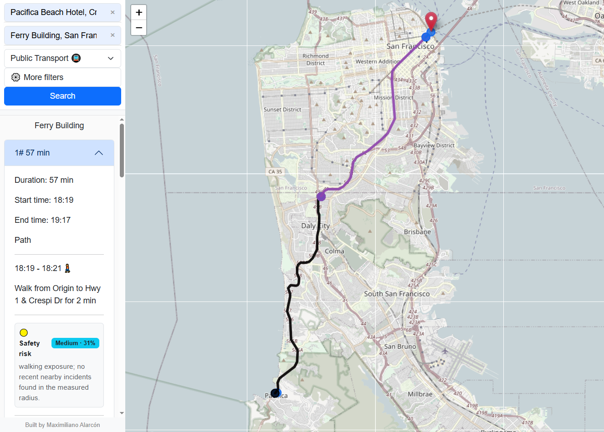

# GPS San Francisco

Transit Routing & Urban Mobility Intelligence Platform

A web-based application that provides intuitive, human-centered transit guidance powered by real-world data and OpenTripPlanner.

## Key Features
- Multimodal routing (transit, walking, driving)
- Human-friendly instructions
- Payment method awareness
- Safety-aware routing (CI SF integration)

## Demo

## Full Documentation
👉 [Read the full documentation](docs/GPS_SF_Documentation.pdf)

##Product
https://gps-san-francisco.up.railway.app/